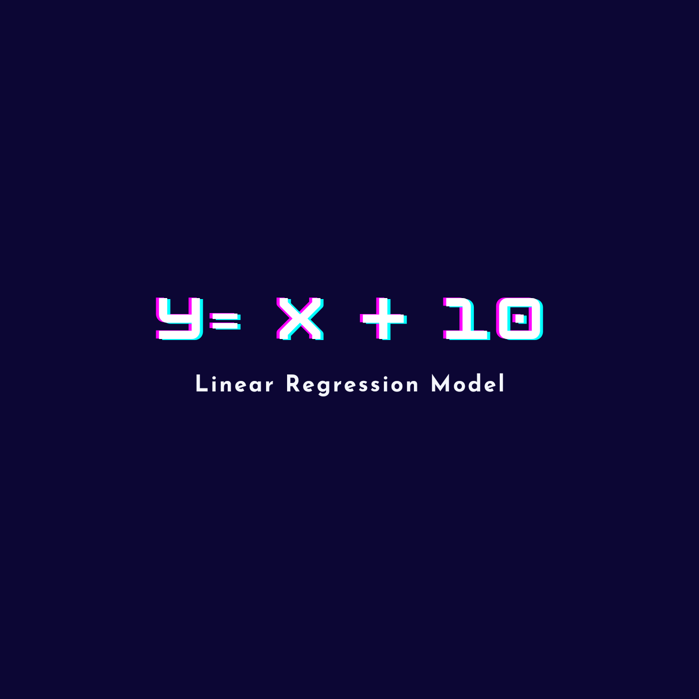

  

<h1 align="center">
  y = x + 10
</h1>

Build by <a href="https://atiq-ur-rehaman.netlify.app/">Adam Al-Rahman</a>

  This is a linear regression machine learning model which predict the y value of respective x value.

y = x + 10, is a line equation i.e, y = mx + c. Here, I've considered slope value(m) = 1 and and the constant(c) = 10.